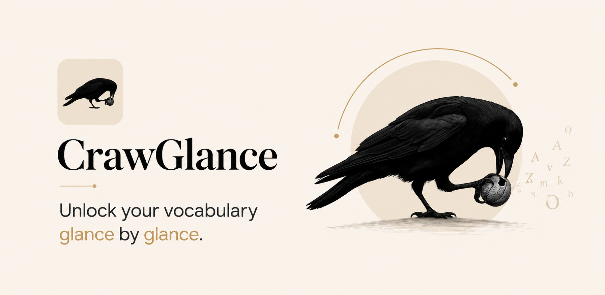
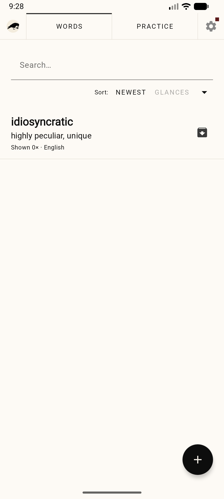
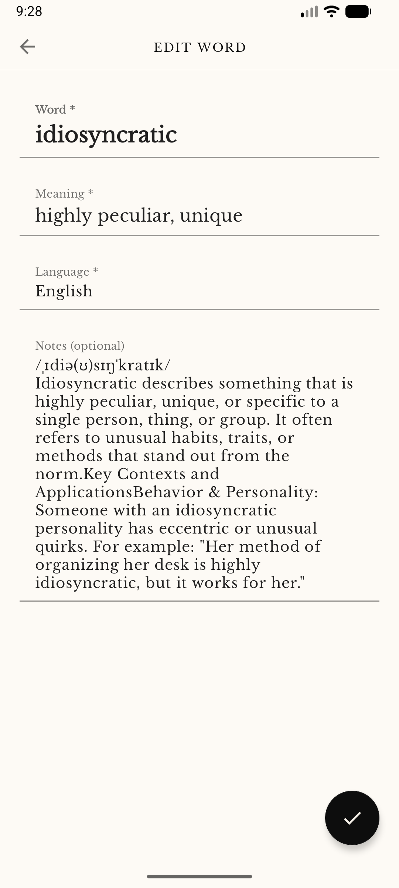
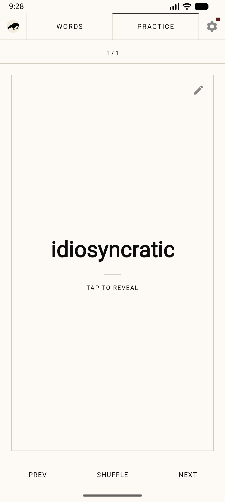
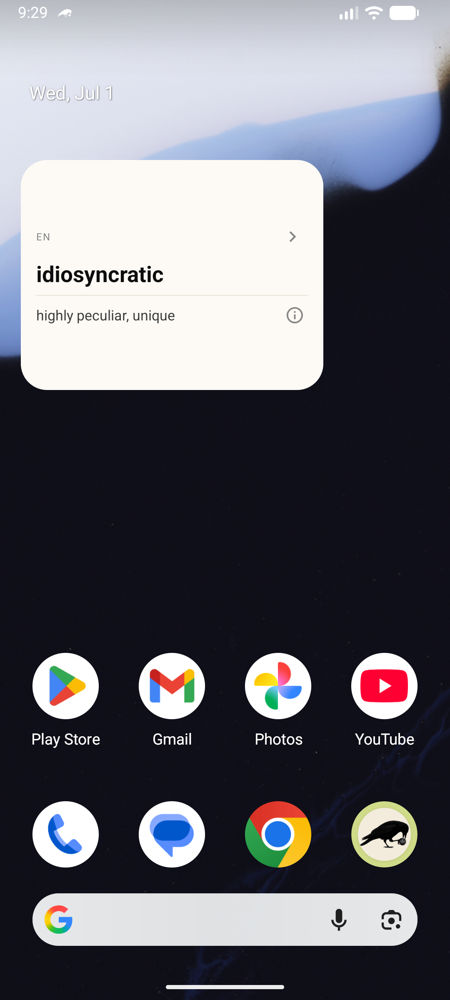
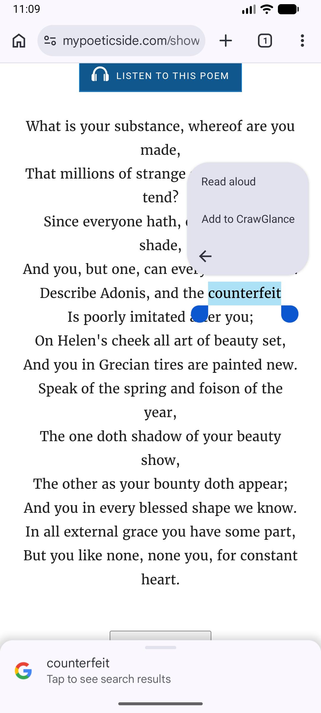
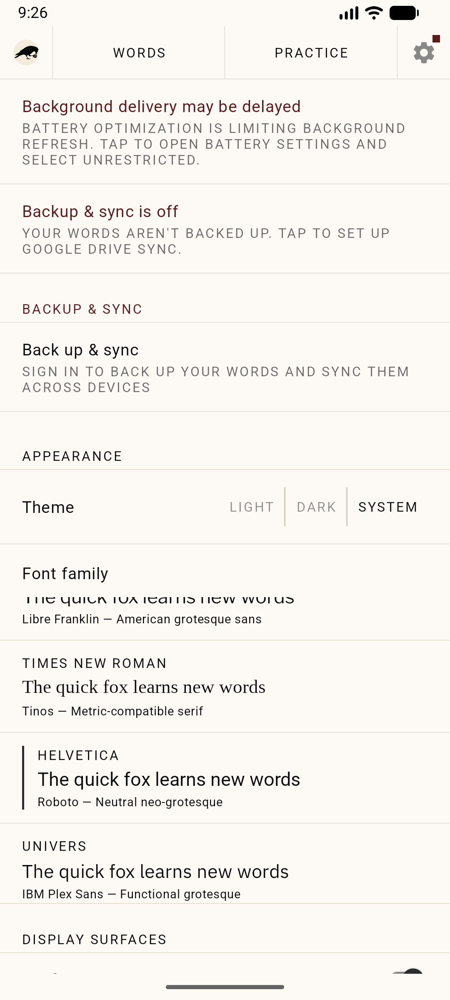
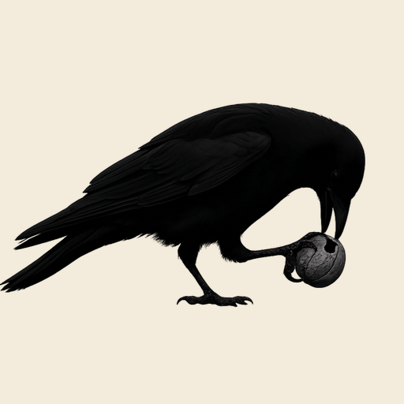

  

<h1 align="center">CrawGlance</h1>

<strong><em>Unlock your vocabulary — glance by glance.</em></strong>

  The average person unlocks their phone around 110 times a day. CrawGlance turns those
  moments into learning. Save a word once and it rides along on your home screen and in a
  calm notification — so the words you want to learn become impossible to miss, without
  ever sitting down to study.

<strong>Now in internal testing on Google Play</strong>

  Android comes first. A <strong>macOS</strong> version is planned next — and with enough
  support from people who find CrawGlance useful, an <strong>iPhone</strong> version can
  follow too.

  <a href="https://docs.google.com/forms/d/e/1FAIpQLSegzRy3MVqwW1YGcCryYFDAmefW5XArGdgIE7qJ-lOvEd5pgw/viewform?usp=header"
     style="display: inline-block; padding: 14px 32px; background: #4f46e5; color: #ffffff;
            font-weight: 700; font-size: 1.05rem; text-decoration: none; border-radius: 12px;
            box-shadow: 0 4px 14px rgba(79,70,229,0.35);">
    Get early access — become a tester or join the waitlist &nbsp;→
  </a>

  Access is granted within 24 hours of submitting the form. Testers get in first and help shape what's built next.

---

## Why I built it

I made CrawGlance for myself first. I wanted a tool that didn't rely on willpower or a
daily study streak — because the hardest part of learning is never the learning, it's
finding the energy to start, again and again.

So instead of asking you to carve out time, CrawGlance builds it into where your attention
already goes. With ~110 unlocks a day, your phone is the most reliable surface you have.
Put a word on it and repetition happens on its own — learning becomes the inevitable
side-effect of using your phone, not another task competing for your motivation.

It won't make you sit down and study. It makes an environment where learning and small
wins happen anyway — so the emotional cost of "getting started" drops close to zero.

---

## Features

- **Learning at a glance** — Add words to your collection and CrawGlance resurfaces them throughout your day. No flashcard grind, no scheduled sessions.
- **Words in your notifications** — Your current word sits in a calm, persistent notification and refreshes as you use your phone. Tune the frequency in Settings.
- **A word on your home screen** — Add the widget to glance at a word and tap through to the next — without even opening the app.
- **Add from anywhere** — Select or share text in any app (browser, reader, chat) and tap **“Add to CrawGlance”** to save it instantly.
- **Flashcard practice** — Quick tap-to-reveal review sessions when you want to test yourself.
- **Private cross-device sync** — Optional Google Drive backup keeps your words and progress safe and in sync across your devices — stored in *your own* Drive, never on our servers.
- **Made to fit you** — Light / dark / system themes and a choice of font families.
- **Private by design** — Your vocabulary stays on your device (and your own Drive). Any diagnostics are anonymous and optional.

---

## Screenshots

<table align="center">
  <tr>
    <td align="center" width="33%">
       
      <b>Your words</b> Search, sort &amp; manage your collection
    </td>
    <td align="center" width="33%">
       
      <b>Rich entries</b> Meaning, language, pronunciation &amp; notes
    </td>
    <td align="center" width="33%">
       
      <b>Practice</b> Tap-to-reveal flashcards
    </td>
  </tr>
  <tr>
    <td align="center" width="33%">
       
      <b>Home-screen widget</b> Glance at a word, tap for the next
    </td>
    <td align="center" width="33%">
       
      <b>Add from anywhere</b> Select text in any app → Add to CrawGlance
    </td>
    <td align="center" width="33%">
       
      <b>Make it yours</b> Themes, fonts, reminders &amp; Drive sync
    </td>
  </tr>
</table>

---

## Privacy

Your vocabulary never leaves your device except to your own Google Drive, and CrawGlance
has no account and no server that stores your data. Read the full
**[Privacy Policy](privacy-policy)**.

---

## Author

   
  Built by <strong>Nazarii Nikitchyn</strong> ·
  <a href="https://www.linkedin.com/in/nazarii-nikitchyn/">LinkedIn</a>

